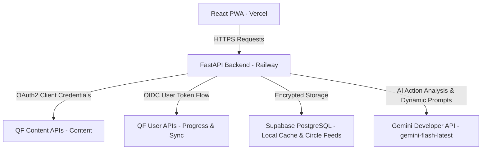

<div align="center">

# تدبّر · Tadabbur

**Read. Reflect. Grow Together.**

*A daily Quranic reflection companion powered by the Quran Foundation APIs*

[](https://react.dev)
[](https://www.typescriptlang.org)
[](https://vitejs.dev)
[](https://tailwindcss.com)
[](https://fastapi.tiangolo.com)
[](https://python.org)
[](https://supabase.com)

</div>

---

## 📺 Demo

[](https://youtu.be/I6bEkRtNIgs?si=D_B_95c0yKUhjb4A)

---

## 🌿 The Problem & Vision

Maintaining a daily connection with the Quran after Ramadan is a common struggle. Setting massive reading goals can feel unsustainable, and personal reflection can feel isolated. 

**Tadabbur** solves this by converting Quran reflection into a shared daily habit. Family and friends reflect on the **exact same daily verse** together in a quiet, dignified digital living room, supported by audio recitations, Tafsir drawers, and dynamic AI prompts. By combining private community circles with active engagement loops—like daily streaks, consistency heatmaps, and Gemini-powered Weekly Reflection Insights—Tadabbur turns journaling into a collaborative, heart-warming journey of lifelong spiritual growth.

---

## 📱 Key Features

* **Verse of the Day (Home)**: A globally synchronized daily verse rendered in beautiful *Scheherazade New* Arabic text. Features a custom audio stream (Mishary Al-Afasy) and a slide-up English Ibn Kathir Tafsir drawer.
* **AI-Powered Dynamic Prompts**: Tailors questions directly to what you read! Reflection prompts 1 and 2 are generated dynamically by Gemini based on today's verse translation and Tafsir context.
* **Heart-to-Practice Guidance**: After writing your reflection, receive a customized, practical daily action prompt (Gemini API) to help carry the heart of the verse into physical daily action.
* **Gemini Weekly Reflection Insights**: Aggregates and analyzes the last 7 days of reflections to produce an encouraging, markdown report detailing recurring themes, signs of personal growth, and gentle advice for the week ahead.
* **Reflection Circles**: Join or invite loved ones to private accountability groups via simple invite links. Read and support each other's daily reflections in a dedicated feed with instant like synchronization.
* **Active Progress Progression**: Earn XP, level up across meaningful ranks (🌱 *Seeker* → 📖 *Learner* → 🤔 *Reflector* → ⚙️ *Practitioner* → 🌟 *Guide*), track daily streaks, and visualize consistency on a GitHub-style heatmap.

---

## 🏗️ Technical Architecture & How It Fits Together

Tadabbur utilizes a robust **hybrid architecture** that balances immediate interactive response times with official platform consistency and security. 

### Architecture Diagram


### Data Flow & Offloading
```
React PWA  ──axios──►  FastAPI  ──x-auth-token──►  QF Content API v4
                           │
                           ├──Bearer token──►  QF User API v1
                           │
                           └──PostgREST──►  Supabase (PostgreSQL)
```

1. **On page load** — backend calls `verses/by_key` + `recitations` + `tafsirs` in parallel (5-minute cache) and logs a `reading-session` to QF.
2. **On reflection submit** — backend stores the reflection locally in Supabase, then fires `notes`, `activity-days`, and optionally `posts` to QF in the background.
3. **On Progress page** — backend merges local Supabase activity with `activity-days` from QF so the heatmap reflects data from both sources.
4. **On Circle create** — backend calls `rooms/groups` to create a matching QF room, so Circle posts also appear on the user's quran.com social feed.

* **Server-Side Token Mediation**: The frontend never holds Quran Foundation credentials or raw tokens.
* **OIDC & Encrypted Storage**: The OIDC Authorization Code flow is managed securely on the backend, with user-specific keys stored encrypted at rest.
* **Read-Performance Offloading**: The application writes notes, activity-days, rooms, and posts back to the official Quran Foundation APIs, but caches read-heavy social interactions (Circle feeds, profiles, likes) locally in Supabase to guarantee sub-millisecond page loads.

---

## 🔗 Quran Foundation API Integration

> All QF API calls are made **server-side** from the FastAPI backend. The React frontend never calls `api.quran.com` directly — it only talks to `/api/*` on the FastAPI server, which holds the QF credentials and proxies all Quran data.

### Content APIs Used

| # | Endpoint | Purpose |
|---|----------|---------|
| 1 | `GET /content/api/v4/verses/by_key/{verse_key}` | Fetch Uthmani Arabic text + English translation (Abdel Haleem, ID 85) for any verse |
| 2 | `GET /content/api/v4/tafsirs/169/by_ayah/{verse_key}` | Fetch Ibn Kathir English tafsir (ID 169) for the displayed verse |
| 3 | `GET /content/api/v4/recitations/7/by_ayah/{verse_key}` | Fetch Mishary Al-Afasy (ID 7) recitation audio path |
| 4 | `GET /content/api/v4/chapters` | List all 114 surah names and metadata for the Explore page |
| 5 | `GET /content/api/v4/verses/by_chapter/{chapter_number}` | List all verses in a surah for the verse browser |

* **Auth**: `x-auth-token` (client-credentials token) + `x-client-id` header. Environment toggled between prelive and production via `QF_ENV`.

### User APIs Used

| # | Endpoint | Purpose |
|---|----------|---------|
| 1 | `POST /api/v1/reading-sessions` | Log that the user read a verse (called on verse load and reflection submit) |
| 2 | `POST /api/v1/notes` | Sync submitted reflection as a QF note tagged `tadabbur` |
| 3 | `POST /api/v1/activity-days` | Record the day as an active reflection day |
| 4 | `GET /api/v1/activity-days?from=&to=` | Fetch activity dates to merge into the local progress heatmap |
| 5 | `GET /api/v1/streaks` | Retrieve current and longest streak for XP bonus calculation |
| 6 | `POST /api/v1/posts` | Share a reflection to the user's QF room (when Circle post is toggled on) |
| 7 | `POST /api/v1/posts/{id}/like` | Like a shared reflection in the Circle feed |
| 8 | `DELETE /api/v1/posts/{id}/like` | Remove a like from a shared reflection |
| 9 | `POST /api/v1/rooms/groups` | Create a QF-backed room when a new Tadabbur Circle is created |

* **Auth**: `Authorization: Bearer {user_qf_access_token}` obtained via OAuth2 authorization code flow (`scope: streak activity_day note room post goal reading_session`).

---

## 🛠️ Local Development & Installation

### Prerequisites
* Node.js (v18+) & `pnpm` / `npm`
* Python (v3.11+) & `venv`
* A free Supabase project
* Quran Foundation API credentials (from [Developer Portal](https://api-docs.quran.foundation))
* Gemini Developer API key (for AI insights)

### 1. Setup Backend
1. Clone the repository and navigate to the backend folder:
   ```bash
   cd backend
   python -m venv venv
   source venv/bin/activate  # On Windows: venv\Scripts\activate
   pip install -r requirements.txt
   ```
2. Create a `.env` file in the `backend/` directory:
   ```env
   # Quran Foundation API
   QF_CLIENT_ID=your_client_id_here
   QF_CLIENT_SECRET=your_client_secret_here
   QF_ENV=prelive                     # "prelive" or "production"
   QF_USER_SCOPES=notes:read notes:write # fallback scopes if dashboard is restricted

   # Supabase Configuration
   SUPABASE_URL=https://your-project.supabase.co
   SUPABASE_SERVICE_KEY=your_service_role_key

   # Gemini API Configuration
   GEMINI_API_KEY=your_gemini_api_key_here
   GEMINI_MODEL=gemini-flash-latest
   GEMINI_BASE_URL=https://generativelanguage.googleapis.com/v1beta/openai/

   # App Configuration
   JWT_SECRET=your_random_64_char_secret
   JWT_EXPIRY_HOURS=168
   FRONTEND_URL=http://localhost:5173
   ```
3. Run the development server:
   ```bash
   uvicorn main:app --reload --port 8000
   ```

### 2. Setup Frontend
1. Navigate to the frontend folder:
   ```bash
   cd ../frontend
   pnpm install  # or npm install
   ```
2. Create a `.env.local` file in the `frontend/` directory:
   ```env
   VITE_API_BASE_URL=http://localhost:8000
   VITE_SUPABASE_URL=https://your-project.supabase.co
   VITE_SUPABASE_ANON_KEY=your_anon_key_here
   ```
3. Run the frontend server:
   ```bash
   pnpm dev
   ```

---

## 🧪 Testing & Linting
Run standard automated checks from the root directory:
```bash
# Run both Pytest (backend) and Vitest (frontend) suites
npm run test

# Run strict TypeScript compilation checks
npm run typecheck

# Run ESLint on the frontend codebase
npm run lint
```

---

## 📁 Project Structure

```
Tadabbur/
├── frontend/                  # React 18 + Vite PWA
│   └── src/
│       ├── pages/             # Home, Explore, Progress, Circle, Onboarding …
│       ├── components/        # VerseCard, AudioPlayer, TafsirDrawer, ReflectionForm …
│       └── store/             # Zustand stores (verse, auth, circle, progress)
├── backend/                   # FastAPI
│   └── app/
│       ├── auth/              # qf_token.py, qf_user_auth.py (OAuth flows)
│       ├── services/          # qf_content.py, qf_user.py, ai_prompts.py, reminder_scheduler.py
│       └── routers/           # verse, tafsir, audio, reflection, circle, progress, auth
├── docs/                      # DEPLOYMENT.md, SUPABASE_SETUP.md, api-usage.md
└── .env.example
```

---

## ⚙️ Tech Stack

| Layer | Stack |
|-------|-------|
| Frontend | React 18, TypeScript, Vite 5, Tailwind CSS, Zustand, Framer Motion |
| PWA | vite-plugin-pwa + Workbox |
| Backend | Python 3.12, FastAPI, httpx, APScheduler |
| Database | Supabase (PostgreSQL + Auth + Storage) |
| AI | Gemini API (`gemini-flash-latest` model via OpenAI-compatible gateway) |
| Quran Data | Quran Foundation Content API v4 + User API v1 |
| Audio CDN | verses.quran.com |

---

## 📄 License
This project is licensed under the MIT License - see the [LICENSE](LICENSE) file for details.

<div align="center">

Built with ❤️ for the **Quran Foundation Hackathon**

</div>
