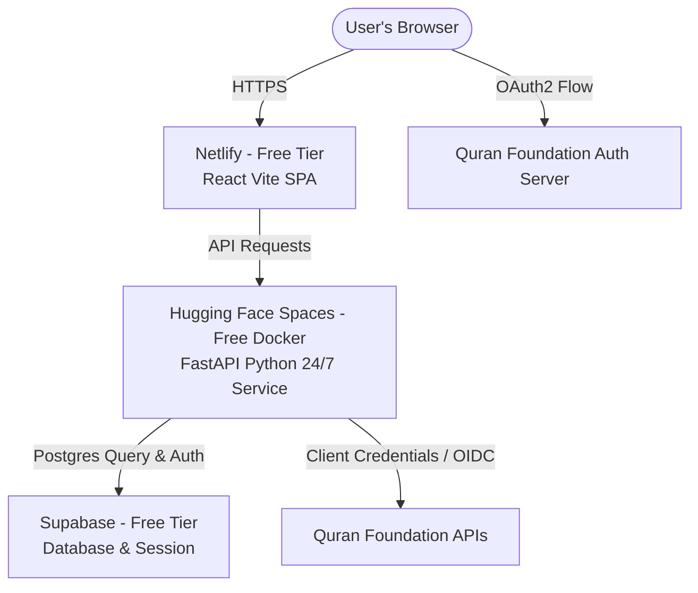

# 🚀 Tadabbur Step-by-Step Production Deployment Guide

This guide describes how to deploy the **Tadabbur** application entirely for free using:
* **Frontend**: Netlify (Vite React SPA)
* **Backend**: Hugging Face Spaces (Dockerized FastAPI, running 24/7)
* **Database & Auth**: Supabase (PostgreSQL, reusing current project)

---

## 🏗️ Production System Architecture



---

## 🎨 Phase 1: Deploy Frontend on Netlify
Netlify will host the static Vite + React SPA.

### 1. Configure the Build on Netlify
1. Go to [Netlify.com](https://www.netlify.com/) and sign up / log in.
2. Click **Add New Site** ➡️ **Import an existing project** and authorize GitHub.
3. Select your repository.
4. Set the following build options:
   * **Base Directory**: `frontend`
   * **Build Command**: `npm run build`
   * **Publish Directory**: `dist` (This automatically resolves to `frontend/dist`)

### 2. Set Environment Variables
Go to **Site Settings ➡️ Environment Variables** and add:

| Key | Example Value | Description |
| --- | --- | --- |
| `VITE_API_BASE_URL` | `https://yourusername-tadabbur-backend.hf.space` | **Your Hugging Face Space Endpoint** (Ensure NO trailing slash) |
| `VITE_SUPABASE_URL` | `https://xxxx.supabase.co` | Your current Supabase URL |
| `VITE_SUPABASE_ANON_KEY` | `eyJhbGci...` | Your current Supabase Anon Key |

### 3. Verification
Click **Deploy Site**. Once the build succeeds, copy your Netlify site URL (e.g. `https://tadabbur.netlify.app`).

> [!NOTE]
> Client-side routing refreshes are automatically supported! The `frontend/public/_redirects` file instructs Netlify to route all routes back to `index.html` with a `200` success code.

---

## ⚡ Phase 2: Deploy Backend on Hugging Face Spaces
Hugging Face Spaces provides a free **24/7 persistent Docker container** (16GB RAM, 2 vCPUs) that does not sleep, ensuring your background daily reflection reminders and token caching run continuously.

### 1. Create a New Hugging Face Space
1. Go to [Hugging Face](https://huggingface.co/) and log in (create a free account if needed).
2. Click on your profile icon in the top right and select **New Space**.
3. Set the following configuration:
   * **Space Name**: `tadabbur-backend` (or any name you prefer)
   * **License**: `mit` (or choose another)
   * **SDK**: Select **Docker** 🐳
   * **Docker Template**: Choose **Blank**
   * **Space Hardware**: Choose **CPU Basic (Free - 16GB RAM, 2 vCPUs)**
   * **Visibility**: **Public** (⚠️ *This makes your Dockerfile and configuration public, but your API keys/secrets are stored separately and remain 100% private.*)
4. Click **Create Space**.

### 2. Define Space Secrets (Environment Variables)
To store secrets safely without exposing them, navigate to **Settings ➡️ Variables and secrets** in your Space dashboard. Click **New secret** to add each variable:

| Key | Example Value | Description |
| --- | --- | --- |
| `QF_CLIENT_ID` | `qf_client_xxx` | Your Quran Foundation Client ID |
| `QF_CLIENT_SECRET` | `qf_secret_xxx` | Your Quran Foundation Client Secret |
| `QF_ENV` | `prelive` | `prelive` for dev keys, `production` for live keys |
| `QF_USER_SCOPES` | `notes:read notes:write` | **OIDC Scopes** to request (Set to this subset to avoid `invalid_scope` errors if credentials are restricted) |
| `SUPABASE_URL` | `https://xxxx.supabase.co` | Your current Supabase URL |
| `SUPABASE_SERVICE_KEY` | `eyJhbGci...` | Supabase Service Role Key (Server-side only) |
| `GEMINI_API_KEY` | `AIzaSy...` | Google AI Studio Gemini API Key |
| `GEMINI_MODEL` | `gemini-2.5-flash` | Gemini model to use for action suggestions |
| `JWT_SECRET` | `your-random-64-character-jwt-key` | Random string to encrypt local JWT auth tokens |
| `FRONTEND_URL` | `https://tadabbur-live.netlify.app` | **Your Netlify Frontend URL** (No trailing slash) |
| `BACKEND_URL` | `https://muhammadhassan24-tadabbur-backend.hf.space` | **Your Hugging Face Space URL** (Details below) |
| `BREVO_API_KEY` | `xkeysib-...` | **Recommended:** Brevo API Key (allows HTTPS email delivery on HF Spaces) |
| `BREVO_SENDER_EMAIL` | `sender@example.com` | **Recommended:** Verified Sender Email in your Brevo Account |
| `GMAIL_SENDER_EMAIL` | `your-email@gmail.com` | *Optional/Fallback:* Gmail address for sending verification OTPs |
| `GMAIL_APP_PASSWORD` | `xxxx xxxx xxxx xxxx` | *Optional/Fallback:* [Google App Password](https://myaccount.google.com/apppasswords) |

> [!TIP]
> **How to derive your Hugging Face Space URL:**
> If your username is `m-hassan` and your Space is called `tadabbur-backend`, the public direct API endpoint is:
> `https://m-hassan-tadabbur-backend.hf.space`

---

### 3. Deploy Only the Backend Directory using Git Subtree
To keep the Hugging Face space clean and build *only* the backend, push the `backend/` subdirectory directly to the Space's Git remote using `git subtree`.

1. Open your terminal at the root of your local workspace.
2. Add the Hugging Face Space git remote (copy the Git URL from your Space's landing page):
   ```bash
   git remote add hf https://huggingface.co/spaces/your-username/tadabbur-backend
   ```
3. Push **only the backend folder** directly to the Space's `main` branch:
   ```bash
   git subtree push --prefix=backend hf main
   ```
4. Hugging Face will automatically detect the `Dockerfile` at the root of the pushed repository, build the image, and start uvicorn on port `7860`.

---

## 🔑 Phase 3: Sync Quran Foundation Redirect URIs

> [!IMPORTANT]
> **Only register backend URIs — never the frontend URL.**
> The Quran Foundation auth server sends the one-time `code` directly to your **FastAPI backend** (`/api/auth/callback`). Your backend handles the token exchange privately using `QF_CLIENT_SECRET`, then redirects the user's browser to your frontend. The frontend URL `https://tadabbur-live.netlify.app/auth/qf-callback` is your own internal route — QF never calls it and it must NOT be whitelisted.

### How the OIDC flow works in this app

```
1. User clicks "Connect quran.com" on Netlify (frontend)
2. Frontend calls backend → backend generates authorization URL
3. User's browser → QF Login Page (redirect_uri = backend /api/auth/callback)
4. User logs in → QF sends `code` to → backend /api/auth/callback  ← ONLY THIS IS WHITELISTED
5. Backend exchanges code for token (server-side, secret never exposed)
6. Backend redirects browser → Netlify /auth/qf-callback (your own route, not registered)
```

### 🌐 Whitelist for Production — Backend (Hugging Face Spaces) only
Add **only** the following two backend URIs to your **Redirect URIs** list in the **Quran Foundation Developer Dashboard**:
* **Auth Callback**: `https://muhammadhassan24-tadabbur-backend.hf.space/api/auth/callback`
* **Logout Callback**: `https://muhammadhassan24-tadabbur-backend.hf.space/api/auth/logout-callback`

### 💻 Whitelist for Local Development — Backend only
* **Auth Callback**: `http://localhost:8000/api/auth/callback`
* **Logout Callback**: `http://localhost:8000/api/auth/logout-callback`

> [!CAUTION]
> **Do NOT add** `https://tadabbur-live.netlify.app` or any frontend URL as a callback. The frontend is never the direct recipient of the authorization code. Adding it would expose your flow to a security vulnerability (the code would arrive at the browser directly, before the secure server-side exchange).

Once added, save your dashboard configurations to apply.

---

## 🔍 Phase 4: Verification & Checklist
Once deployed, perform these checks:
1. **Health Endpoint**: Visit `https://muhammadhassan24-tadabbur-backend.hf.space/health` in your browser. It should return `{"status":"ok","version":"1.0.0"}`.
2. **Page Refreshes**: Navigate to your Netlify URL (`https://tadabbur-live.netlify.app`), go to `/circle`, and hit refresh. The page should reload successfully (verifying the Netlify `_redirects` rule).
3. **User Flow**: Register a new account. You should receive a verification OTP email instantly via Brevo HTTP API (or Gmail SMTP).
4. **AI Generation**: Answer a daily reflection and verify that the Gemini action suggestion appears as a `"💡 You might also consider..."` pop-up.
